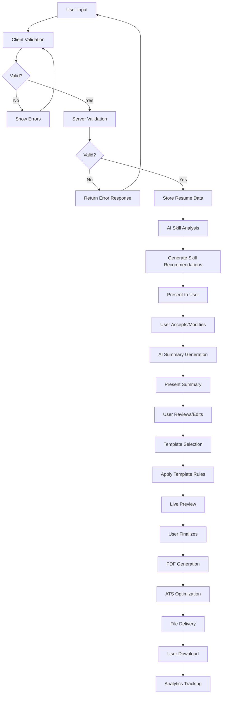

# Sample Flow and Data Processing Pipeline

## User Journey Flow

### 1. Initial User Interaction
```
User visits website → Landing Page → Login/Register → Dashboard
```

### 2. Resume Builder Initiation
```
Dashboard → Click "Create New Resume" → User Type Selection
```

### 3. User Type Selection
```
Select: Fresher or Experienced Professional
  ├── If Fresher: Hide Experience section
  └── If Experienced: Show Experience section
```

### 4. Form Completion Flow
```
1. Personal Information
   ├── Full Name (required)
   ├── Email (required)
   ├── Phone (optional)
   ├── Location (optional)
   ├── LinkedIn (optional)
   └── GitHub (optional)

2. Education Details (at least one required)
   ├── Degree/Course Name
   ├── Institution Name
   ├── Start Year
   ├── End Year (or Currently Studying)
   └── Location

3. AI-Powered Skill Recommendations
   ├── System analyzes degree/course
   ├── Presents relevant skills
   ├── User accepts/modifies skills
   └── Skills saved to profile

4. Professional Summary Generation
   ├── AI generates summary based on inputs
   ├── User reviews and customizes
   └── Summary saved

5. Optional Sections (based on user type)
   ├── Work Experience (experienced users only)
   │   ├── Job Title
   │   ├── Company
   │   ├── Dates
   │   └── Bullet Points
   ├── Projects
   │   ├── Project Name
   │   ├── Description
   │   └── Technologies
   ├── Certifications
   │   ├── Certification Name
   │   └── Issuing Organization
   └── Achievements
       ├── Achievement Title
       └── Description

6. Template Selection
   ├── Classic Single Column
   └── Modern Two-Column

7. Live Preview
   ├── Real-time rendering of resume
   ├── Edit in preview mode
   └── Validate content

8. PDF Generation and Download
   ├── Generate ATS-optimized PDF
   ├── Verify formatting
   └── Download resume
```

## Data Processing Pipeline

### Stage 1: Data Collection and Validation
```
User Input → Client-Side Validation → Server-Side Validation → Data Storage
```

#### Client-Side Validation
- Real-time field validation
- Format checking
- Required field enforcement
- Cross-field validation

#### Server-Side Validation
- Data type verification
- Security checks
- Business rule validation
- Duplicate detection

#### Data Storage
- Store in resumes table
- Store sections in resume_sections table
- Cache AI recommendations

### Stage 2: AI Processing and Enhancement
```
Validated Data → AI Analysis → Recommendations → User Review → Finalization
```

#### AI Analysis Components
1. **Skill Analysis**
   - Degree/course mapping
   - Experience correlation
   - Market demand assessment

2. **Content Enhancement**
   - Bullet point improvement
   - Action verb optimization
   - Keyword insertion

3. **Summary Generation**
   - Template selection
   - Placeholder replacement
   - ATS optimization

#### Recommendation Presentation
- Interactive skill selection
- Summary preview
- Enhancement suggestions

#### User Review and Finalization
- Accept/reject recommendations
- Manual customization
- Final approval

### Stage 3: Template Processing
```
Finalized Data → Template Selection → Layout Processing → Formatting
```

#### Template Selection
- User choice between templates
- Conditional section handling
- Responsive layout adaptation

#### Layout Processing
- Section ordering
- Column arrangement (for two-column template)
- White space optimization

#### Formatting
- Font standardization
- Margin adjustment
- ATS compatibility checks

### Stage 4: PDF Generation
```
Formatted Data → PDF Engine → ATS Optimization → File Creation
```

#### PDF Engine
- Use ReportLab for PDF generation
- Font embedding
- Text selection preservation

#### ATS Optimization
- Keyword density analysis
- Format verification
- Text extraction testing

#### File Creation
- Metadata embedding
- File naming convention
- Storage and retrieval setup

### Stage 5: Delivery and Tracking
```
Generated PDF → User Download → Analytics Tracking → Feedback Collection
```

#### User Download
- Direct download link
- Email delivery option
- Cloud storage integration

#### Analytics Tracking
- Download counting
- User behavior analysis
- Feature usage metrics

#### Feedback Collection
- Resume quality rating
- Feature satisfaction
- Improvement suggestions

## Detailed Data Flow Diagram



## API Integration Flow

### Frontend to Backend Communication
```
1. Form Data Submission
   POST /api/resume/save
   ← 200 OK with resume_id

2. Skill Recommendations Request
   POST /api/skill-recommendations
   ← 200 OK with skill list

3. Summary Generation Request
   POST /api/generate-summary
   ← 200 OK with summary text

4. Content Enhancement Request
   POST /api/optimize-content
   ← 200 OK with enhanced text

5. Preview Request
   GET /api/resume/preview/{resume_id}
   ← 200 OK with formatted data

6. PDF Generation Request
   POST /api/resume/generate-pdf
   ← 200 OK with PDF file
```

## Database Schema Integration

### Resume Table
```sql
resumes (
    id INTEGER PRIMARY KEY,
    user_id INTEGER,
    template_type TEXT,
    created_at TIMESTAMP,
    updated_at TIMESTAMP,
    is_public BOOLEAN
)
```

### Resume Sections Table
```sql
resume_sections (
    id INTEGER PRIMARY KEY,
    resume_id INTEGER,
    section_type TEXT,
    section_data TEXT,  -- JSON data
    display_order INTEGER,
    created_at TIMESTAMP,
    updated_at TIMESTAMP
)
```

### Data Flow in Database
1. User creates resume → Insert into resumes table
2. Each section saved → Insert into resume_sections table
3. AI recommendations → Store in recommendations cache
4. PDF generation → Track in downloads table

## Error Handling Flow

### Validation Errors
```
User Input → Validation → Error? → Yes → Show Inline Errors → User Corrects
                              → No → Proceed to Next Step
```

### System Errors
```
Processing Step → Error? → Yes → Log Error → Show User-Friendly Message
                        → No → Continue Processing
```

### Recovery Mechanisms
- Auto-save drafts
- Error state preservation
- Retry mechanisms for transient failures
- Graceful degradation for non-critical features

## Performance Considerations

### Loading Optimization
- Lazy loading for non-essential sections
- Progressive enhancement of AI features
- Caching of frequently accessed data

### Processing Efficiency
- Parallel processing of independent sections
- Asynchronous AI processing
- Batch operations where possible

### Memory Management
- Streaming for large data sets
- Efficient data structures
- Cleanup of temporary data

## Security Measures

### Data Protection
- Input sanitization
- Output encoding
- Secure database connections

### Access Control
- Authentication for all operations
- Authorization for resume access
- Session management

### Privacy
- Data retention policies
- User data deletion
- Compliance with privacy regulations

## Testing Strategy

### Unit Tests
- Validation functions
- AI processing algorithms
- Template rendering
- PDF generation

### Integration Tests
- End-to-end form submission
- API endpoint testing
- Database operations
- Third-party service integration

### User Acceptance Testing
- Usability testing
- Accessibility verification
- Cross-browser compatibility
- Mobile responsiveness

## Monitoring and Maintenance

### Health Checks
- API endpoint availability
- Database connectivity
- Third-party service status
- Performance metrics

### Logging
- User actions
- System errors
- Performance data
- Security events

### Alerting
- Error rate thresholds
- Performance degradation
- System availability
- Security incidents